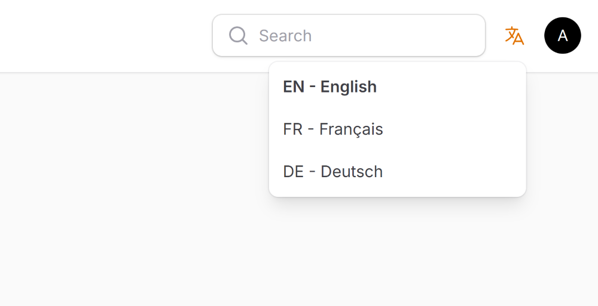

# Filament Language Switcher

A simple and elegant language switcher plugin for Filament admin panels. Automatically detects available Filament translations or allows custom language configuration with optional flag icons.


## Installation

| Plugin Version | Filament Version | PHP Version |
|----------------|------------------|-------------|
| 1.x            | 3.x, 4.x         | \> 8.1      |

Install the package via Composer:

```bash
composer require craft-forge/filament-language-switcher
```

## Usage
Register the plugin in your Filament panel configuration: (e.g.  `AdminPanelProvider`).

```php
use CraftForge\FilamentLanguageSwitcher\FilamentLanguageSwitcherPlugin;
use Filament\Panel;

public function panel(Panel $panel): Panel
{
    return $panel
        // ...
        ->plugins([
            FilamentLanguageSwitcherPlugin::make(),
        ]);
}
```

The plugin will automatically detect available Filament language files and display them in a dropdown menu.

## Configuration
### Custom Languages
Define your own language list instead of auto-detection:

```php
FilamentLanguageSwitcherPlugin::make()
    ->locales([
        ['code' => 'en', 'name' => 'English', 'flag' => 'gb'],
        ['code' => 'uk', 'name' => 'Українська', 'flag' => 'ua'],
        ['code' => 'de', 'name' => 'Deutsch', 'flag' => 'de'],
    ])
```
The `name` and `flag` parameters are optional. When omitted, the plugin automatically generates them from its built-in language dictionary:
```php
FilamentLanguageSwitcherPlugin::make()
    ->locales([
        ['code' => 'en', 'flag' => 'us'],
        ['code' => 'fr'],
        ['code' => 'de'],
    ])
```

For flag codes, please refer to https://flagicons.lipis.dev (e.g., pl for Poland).


### Hide Flags
Display only language codes and names without flag icons:
```php
FilamentLanguageSwitcherPlugin::make()
    ->showFlags(false)
```


### Custom Render Hook
Change where the language switcher appears in your panel:
```php
use Filament\View\PanelsRenderHook;

FilamentLanguageSwitcherPlugin::make()
    ->renderHook(PanelsRenderHook::USER_MENU_PROFILE_AFTER)
```
Available render hooks: https://filamentphp.com/docs/4.x/advanced/render-hooks#panel-builder-render-hooks


## License
The MIT License (MIT). Please see [License File](LICENSE.md) for more information.
