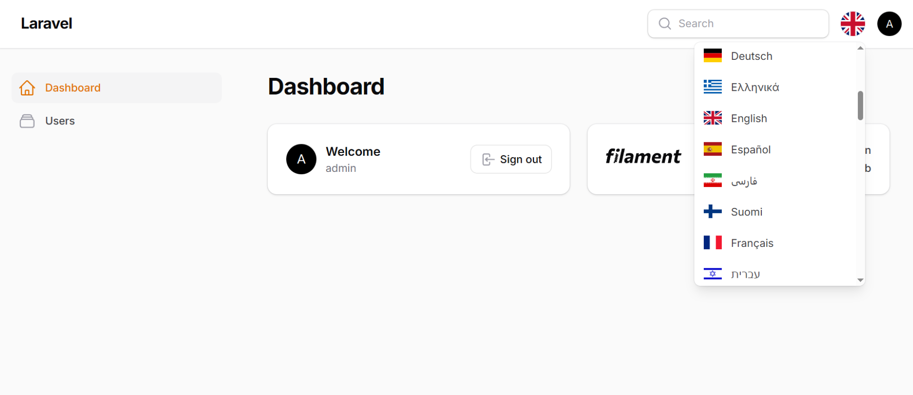
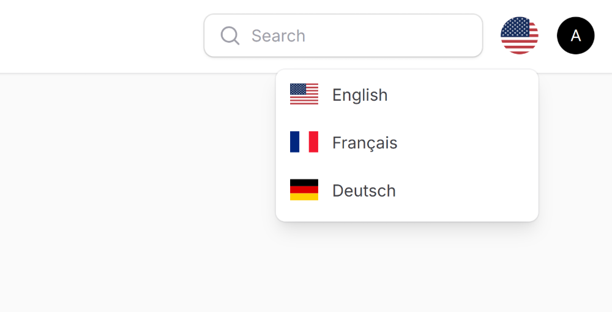
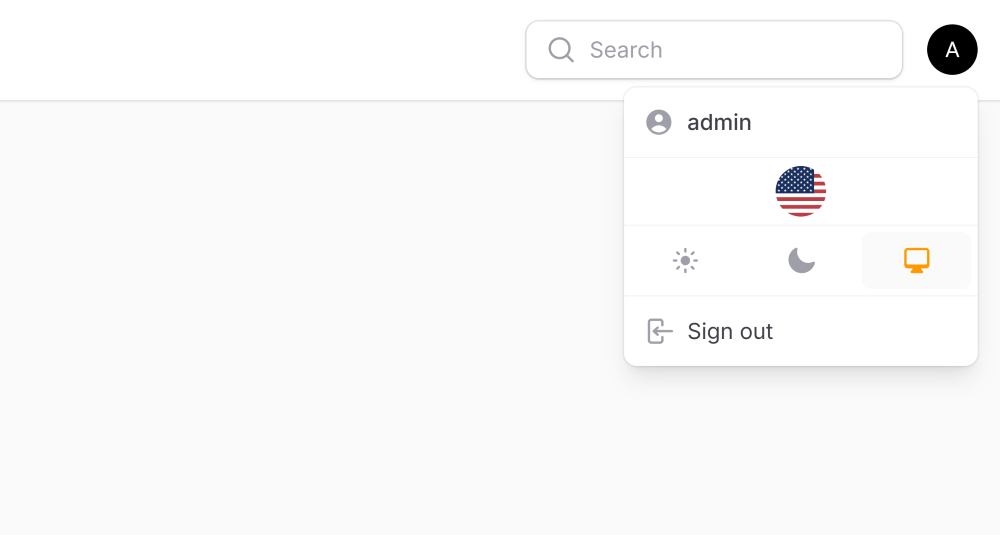

# Filament Language Switcher

A simple and elegant language switcher plugin for Filament admin panels. Automatically detects available Filament translations or allows custom language configuration with optional flag icons.




## Installation

| Plugin Version | Filament Version | PHP Version |
|----------------|------------------|-------------|
| 1.x            | 3.x, 4.x, 5.x    | \> 8.1      |

**1. Install the package via Composer:**

```bash
composer require craft-forge/filament-language-switcher
```

**2. Register the plugin in your Filament panel configuration (e.g. `AdminPanelProvider`):**

```php
use CraftForge\FilamentLanguageSwitcher\FilamentLanguageSwitcherPlugin;

public function panel(Panel $panel): Panel
{
    return $panel
        ->plugins([
            FilamentLanguageSwitcherPlugin::make(),
        ]);
}
```

The plugin will automatically detect available Filament language files and display them in a dropdown menu.

## Configuration
### Custom Languages
Define your own language list instead of auto-detection:

```php
FilamentLanguageSwitcherPlugin::make()
    ->locales(['en', 'fr', 'de'])
```

The plugin automatically resolves language names and flag icons from its built-in dictionary (200+ languages including regional variants). For full control over names and flags, pass an array of arrays:

```php
FilamentLanguageSwitcherPlugin::make()
    ->locales([
        ['code' => 'en', 'name' => 'English', 'flag' => 'us'],
        ['code' => 'fr', 'name' => 'Français', 'flag' => 'fr'],
        ['code' => 'de', 'name' => 'Deutsch', 'flag' => 'de'],
    ])
```

For flag codes, please refer to https://flagicons.lipis.dev.

You can also pass a Closure to load languages dynamically (e.g. from a database):

```php
FilamentLanguageSwitcherPlugin::make()
    ->locales(fn () => Language::pluck('code')->toArray())
```



### Show on Auth Pages
Display the language switcher on login, register, and password reset pages:
```php
FilamentLanguageSwitcherPlugin::make()
    ->showOnAuthPages()
```

### Remember Locale
Store the selected locale in a cookie to persist across browser sessions:
```php
FilamentLanguageSwitcherPlugin::make()
    ->rememberLocale(days: 30)
```

### Hide Flags
Display only language names without flag icons:
```php
FilamentLanguageSwitcherPlugin::make()
    ->showFlags(false)
```

### Custom Render Hook
Change where the language switcher appears in your panel:
```php
use Filament\View\PanelsRenderHook;

FilamentLanguageSwitcherPlugin::make()
    ->renderHook(PanelsRenderHook::USER_MENU_PROFILE_AFTER)
```

Popular placements:
- `USER_MENU_BEFORE` — before the user menu (default)
- `USER_MENU_PROFILE_AFTER` — after user profile in dropdown
- `USER_MENU_AFTER` — after the user menu
- `SIDEBAR_FOOTER` — at the bottom of sidebar
- `FOOTER` — in the page footer

All available render hooks: [https://filamentphp.com/docs/5.x/advanced/render-hooks](https://filamentphp.com/docs/5.x/advanced/render-hooks#available-render-hooks)



## Events

The plugin dispatches a `LocaleChanged` event whenever a user switches locale, providing both the new and previous locale:

```php
use CraftForge\FilamentLanguageSwitcher\Events\LocaleChanged;
use Illuminate\Support\Facades\Event;

Event::listen(LocaleChanged::class, function (LocaleChanged $event) {
    auth()->user()->update(['preferred_locale' => $event->newLocale]);

    Log::info("Locale changed from {$event->oldLocale} to {$event->newLocale}");
});
```

## License
The MIT License (MIT). Please see [License File](LICENSE.md) for more information.
